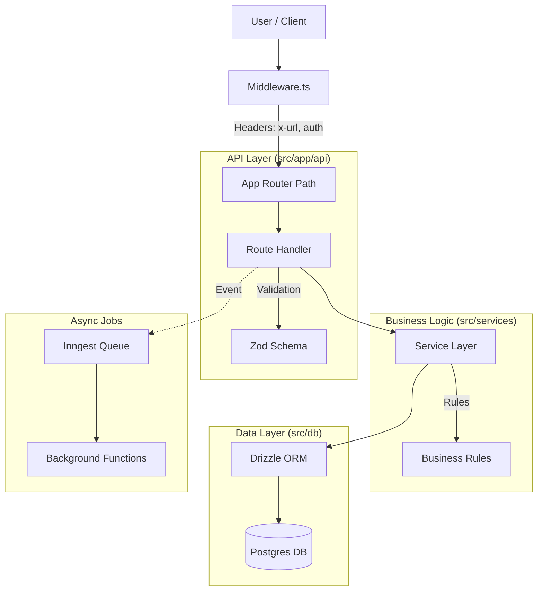

# 🏗️ Backend Architecture

The Enterprise OS backend is built on **Next.js App Router** but structured like a robust backend service. We verify strictly to the **Service-Repository Pattern** to ensure scalability and testability.

## 🔄 High-Level Data Flow

Every request goes through this pipeline:

## 🧩 Key Components

### 1. Middleware (`src/middleware.ts`)
The "Gatekeeper". It runs before every request to:
*   **Identify Tenant**: Resolves subdomain to Team ID.
*   **Verify Auth**: Checks JWT/Session tokens.
*   **Rate Limit**: Uses Upstash Redis to prevent abuse.

### 2. Route Handlers (`src/app/api/...`)
The "Entry Point".
*   **Strict Rule**: No business logic here. Only input validation and Service calls.
*   **Role**: Returns JSON responses (`NextResponse`).

### 3. Service Layer (`src/services/...`)
The "Brain". This is where strict business rules live.
*   **Files**: `authService.ts`, `billingService.ts`, `teamService.ts`, etc.
*   **Role**: Framework-agnostic. It doesn't know about HTTP request/response.

### 4. Database Layer (`src/db`)
The "Storage".
*   **Technology**: **Drizzle ORM** (Lightweight, SQL-like).
*   **Schema**: Defined in `src/db/schema.ts`.
*   **Migrations**: Managed via Drizzle Kit.

### 5. Async Background Jobs (`src/inngest`)
The "Worker".
*   **Technology**: **Inngest**.
*   **Use Cases**: Sending emails, processing file uploads, executing long-running AI tasks.
*   **Benefit**: Prevent API timeouts on heavy tasks.

---

## 🔒 Security & Privacy

### Privacy Layer (PII Masking)
We have a dedicated middleware/utility in `src/lib/pii-masking.ts` that automatically scans text content (like AI responses) and masks sensitive data (Names, Emails, Credit Cards) based on user-configured rules before it hits the database or client.
