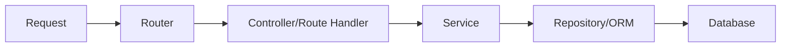

# Backend Architecture

We strictly adhere to the **Service-Repository Pattern**. This prevents "Fat Controllers" and ensures the code is maintainable.

## The 3-Layer Flow

Data flows through the application in this specific order:

### 1. Route Handler Layer (`src/app/api/...`)

**Responsibility:** HTTP Adapter.

* Receives the Request (`req`).
* Validates input (using `zod` or manual validation).
* Delegates business logic to the **Service**.
* Sends the Response (`res`).
* > **Note:** Never write database queries here.

### 2. Service Layer (`src/services`)

**Responsibility:** Business Logic.

* Contains the core rules of your application.
* Handles password hashing, billing calculations, and AI prompt processing.
* Throws errors if rules are violated.
* > **Note:** Framework agnostic. It doesn't know what `req` or `res` is.

### 3. Repository/Data Layer (`src/db`)

**Responsibility:** Data Access.

* Direct communication with **Drizzle ORM** (or Prisma).
* Handles CRUD operations (Create, Read, Update, Delete).
